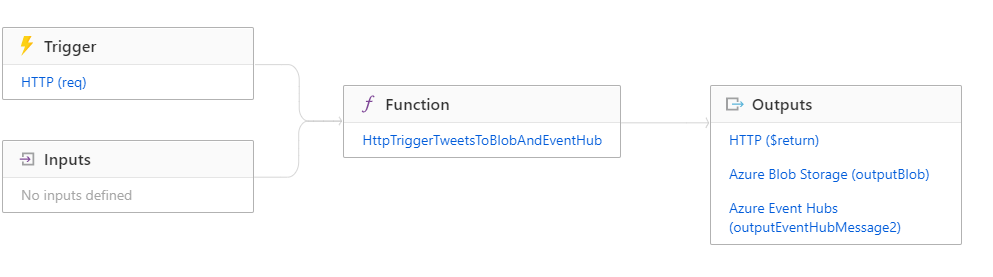
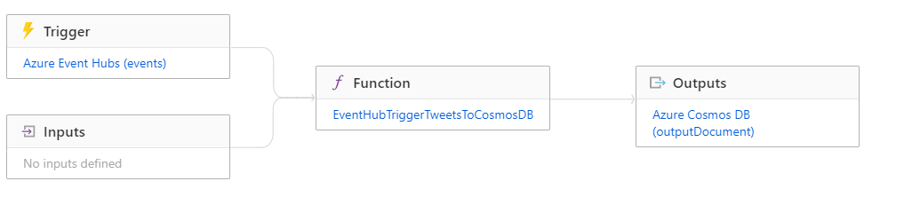
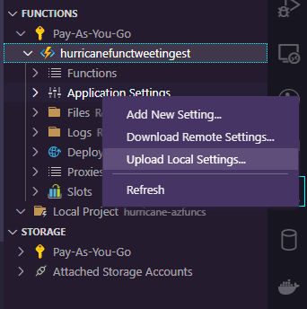

# Azure Functions - Azure Streaming Data Pipeline

This repository contains two Azure Functions as a part of an Azure streaming data pipeline ([see Azure Data Engineering Project](https://github.com/team-data-science/azure-data-engineering)):

1) Azure Function acting as a backend in Azure API management that takes json tweet messages, checks validity and conformity to a predefined json schema (see function code) and if ok, passes is on to Azure Event Hub (and writes to Azure Blob Storage). 
   - `./HttpTriggerTweetToBlobAndEventHub`

Schema:

2) Azure Function that takes messages from Azure Event Hub and writes them to Azure Cosmos Database
   - `./EventHubTriggerTweetToCosmosDB`

Schema:

## Getting Started

#### Prerequisites

- Install Python 3.8.5
- Install [Functions Core Tools](https://docs.microsoft.com/en-us/azure/azure-functions/functions-run-local#v2)
- Visual Studio Code
  - plugins:
    - Azure Functions
- Note: If run on Windows, use Ubuntu WSL to run deploy script

### Deploy to Azure

#### Steps

All steps were done via Visual Studio Code and Azure Functions plugin.

- Project was created via `Create New Project`.

- Functions were created via `Create New Function`.

- Functions were deployted via `Deploy to Function App`.

Note: Do not forget to upload the local settings to applications settings in Azure. You will either be prompted after deployment or you can navigate to here:

### Local Testing

For any local testing, use the sample local.settings.json and host.json, create [virtual environment](https://docs.microsoft.com/en-us/azure/azure-functions/functions-create-first-function-python#create-and-activate-a-virtual-environment) and run `func host start`

## References

- [Create your first Python Function](https://docs.microsoft.com/azure/azure-functions/functions-create-first-function-python)
