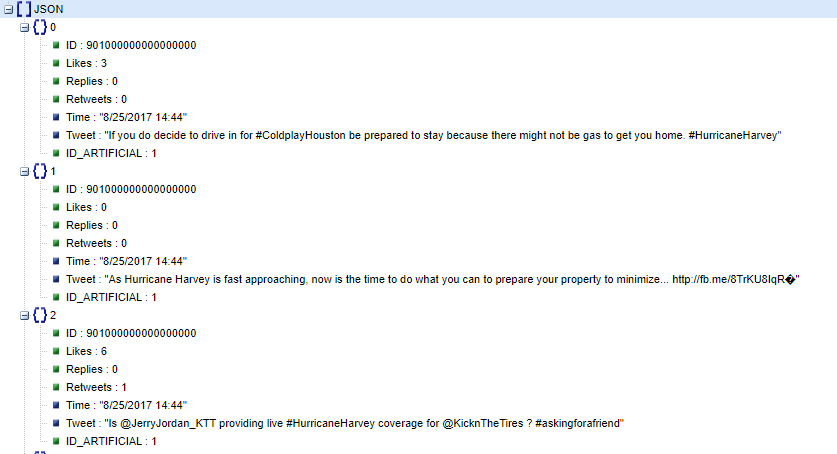
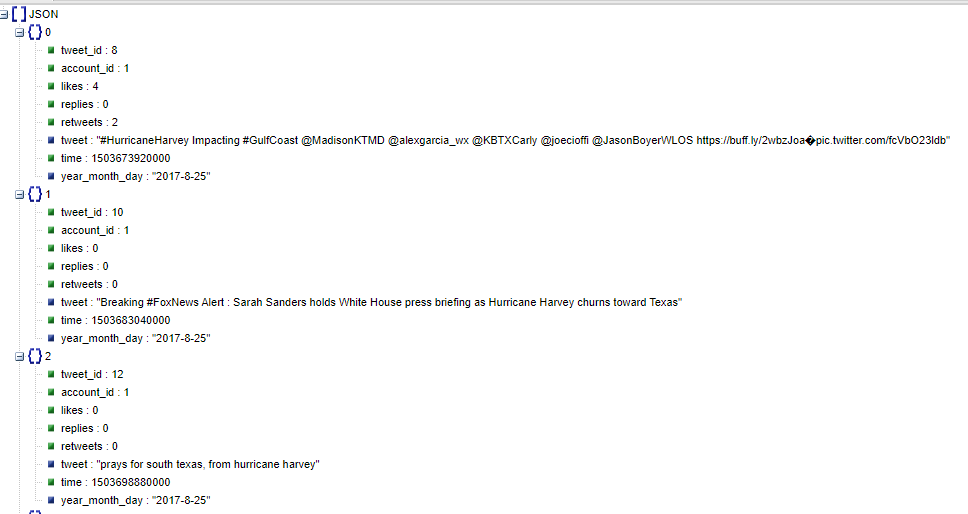
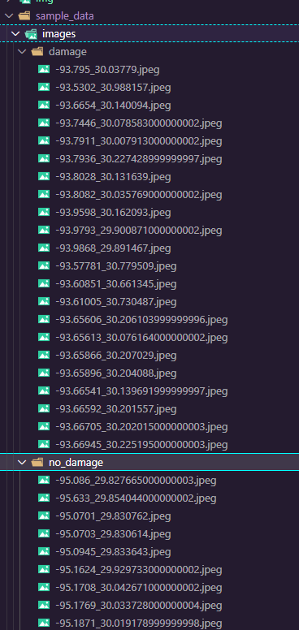
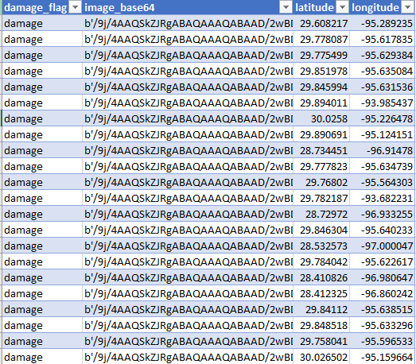
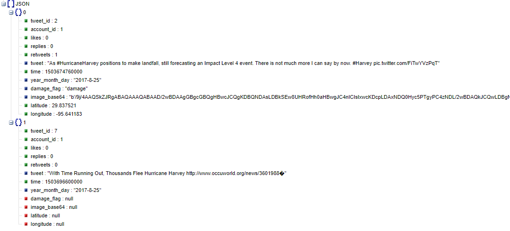
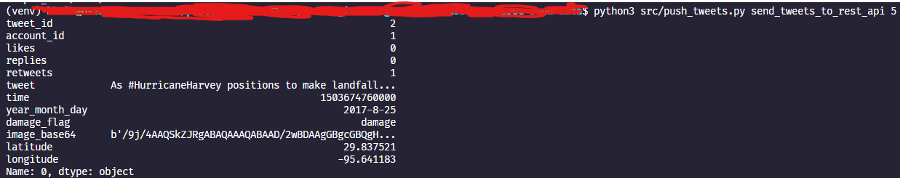

<h1 align="center"> Processing of Hurricane Harvey Tweets and Satelite Images and Python CLI for Sending the Tweets to REST API👋</h1>
<p>
  <a href="https://twitter.com/kbakaric1" target="_blank">
    
  </a>
</p>


<p align="center">

<p>


<br />
<p align="center">

  <h3 align="center">Processing of Hurricane Harvey Tweets and Satelite Images and Python CLI for Sending the Tweets to REST API</h3>

  <p align="center">
  
  <p>

  

  <p align="center">
    Project contains python processing code with a purpose to combine tweets and encode satelite images (and metadata from file tree structure) to base64. All content, tweets and images are related to hurricane Harvey. In addition, there is a code that simulates tweet messaging from a local client. NOTE: Since there is no real relation between tweets and satelite images, for the purpose of endgineering data pipelines, I have simulated and randomly assigned ids from images to tweets.
    <br />
  </p>
</p>


<!-- TABLE OF CONTENTS -->
<details open="open">
  <summary><h2 style="display: inline-block">Table of Contents</h2></summary>
  <ol>
    <li>
      <a href="#about-the-project">About The Project</a>
      <ul>
        <li><a href="#built-with">Built With</a></li>
      </ul>
    </li>
     <li><a href="#data-sources">Data Sources</a></li>
    <li>
      <a href="#getting-started">Getting Started</a>
      <ul>
        <li><a href="#prerequisites">Prerequisites</a></li>
        <li><a href="#installation">Installation</a></li>
      </ul>
    </li>
    <li><a href="#usage">Usage</a></li>
    <li><a href="#contributing">Contributing</a></li>
    <li><a href="#license">License</a></li>
    <li><a href="#contact">Contact</a></li>
    <li><a href="#acknowledgements">Acknowledgements</a></li>
  </ol>
</details>

<!-- ABOUT THE PROJECT -->
## About The Project

Project contains python processing code with a purpose to combine tweets and encode satelite images (and metadata from file tree structure) to base64. All content, tweets and images are related to hurricane Harvey. In addition, there is a code that simulates tweet messaging from a local client.

### Built With

* [Python 3.8.5](https://www.python.org/downloads/release/python-385/)
* [Pandas](https://pandas.pydata.org/docs/)
* [Requests](https://2.python-requests.org/en/master/)
* [Fire](https://google.github.io/python-fire/)


## Data Sources

- [Hurricane Harvey Tweets](https://www.kaggle.com/dan195/hurricaneharvey) from Kaggle.

  Tweets containing Hurricane Harvey from the morning of 8/25/2017. I hope to keep this updated if computer problems do not persist.

  *8/30 Update
  This update includes the most recent tweets tagged "Tropical Storm Harvey", which spans from 8/20 to 8/30 as well as the properly merged version of dataset including Tweets from when Harvey before it was downgraded back to a tropical storm.

- [Satellite Images of Hurricane Damage](https://www.kaggle.com/kmader/satellite-images-of-hurricane-damage) from Kaggle.

  Overview
  The data are satellite images from Texas after Hurricane Harvey divided into two groups (damage and no_damage). The goal is to make a model which can automatically identify if a given region is likely to contain flooding damage.

  Source
  Data originally taken from: https://ieee-dataport.org/open-access/detecting-damaged-buildings-post-hurricane-satellite-imagery-based-customized and can be cited with http://dx.doi.org/10.21227/sdad-1e56 and the original paper is here: https://arxiv.org/abs/1807.01688


<!-- GETTING STARTED -->
## Getting Started

To get a local copy up and running follow these simple steps.

### Prerequisites

**Note: I am using WSL2 with Ubuntu 20 installed on my Windows OS.**

This is an example of how to list things you need to use the software and how to install them.

### Installation

1. Clone the repo 


2. Create a virtual environment  
  ```sh
  python3 -m venv venv
  ```

3. Activate virtual environment  
  ```sh
  source venv/bin/activate
  ```

4. install python packages
  ```shf
  pip3 install -r requirements.txt
  ```


<!-- USAGE EXAMPLES -->
## Usage

Project Contains **four functions**. 
Go to data sources and get the full datasets.

NOTE: Since there is no real relation between tweets and satelite images, for the purpose of endgineering data pipelines, I have simulated and randomly assigned ids from images to tweets.


###  `preprocess_twitter.py`

>> Function processes original tweet messages.

**Before processing:**

<p align="center">
  
<p>

**After processing:**

<p align="center">
  
<p>
  
###  `preprocess_images.py`

>> Function processes file paths and names into an attribute table, together with a column that contains base64 encoded images..

<p align="center">
  
<p>

**After processing:**

<p align="center">
  
<p>
  
### `merge_tweets_images.py`

>> Function merges processed tweet json and images into a single json file where images are base 64 encoded.

**After merging processed tweets and images:**

<p align="center">
  
<p>
  
### `push_tweets.py`

>> Function converted to Python CLI. It sends tweet records from json as requets with a predefined header and schema. 

**In a comandline type (number 5 is an argumend for number of tweets you would like to send towards REST API endpoint):**

```sh
python3 src/push_tweets.py send_tweets_to_rest_api 5
```

**To send 5 tweet messages, one by one to defined REST API endpoint in Azure.**

<p align="center">
  
<p>


<!-- CONTRIBUTING -->
## Contributing

Contributions are what make the open source community such an amazing place to be learn, inspire, and create. Any contributions you make are **greatly appreciated**.

1. Fork the Project
2. Create your Feature Branch (`git checkout -b feature/AmazingFeature`)
3. Commit your Changes (`git commit -m 'Add some AmazingFeature'`)
4. Push to the Branch (`git push origin feature/AmazingFeature`)
5. Open a Pull Request


<!-- LICENSE -->
## License

Distributed under the MIT License. See `LICENSE` for more information.

<!-- CONTACT -->
## Author

👤 **Kristijan Bakaric**

* Website: 
* Twitter: [@kbakaric1](https://twitter.com/kbakaric1)
* Github: [@baky0905](https://github.com/baky0905)
* LinkedIn: [@kristijanb](https://linkedin.com/in/kristijanb)

## Show your support

Give a ⭐️ if this project helped you!

***
_This README was generated with ❤️ by [readme-md-generator](https://github.com/kefranabg/readme-md-generator)_
